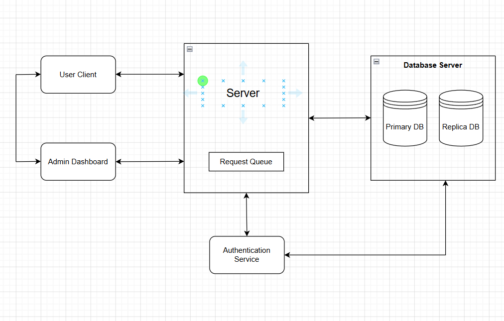
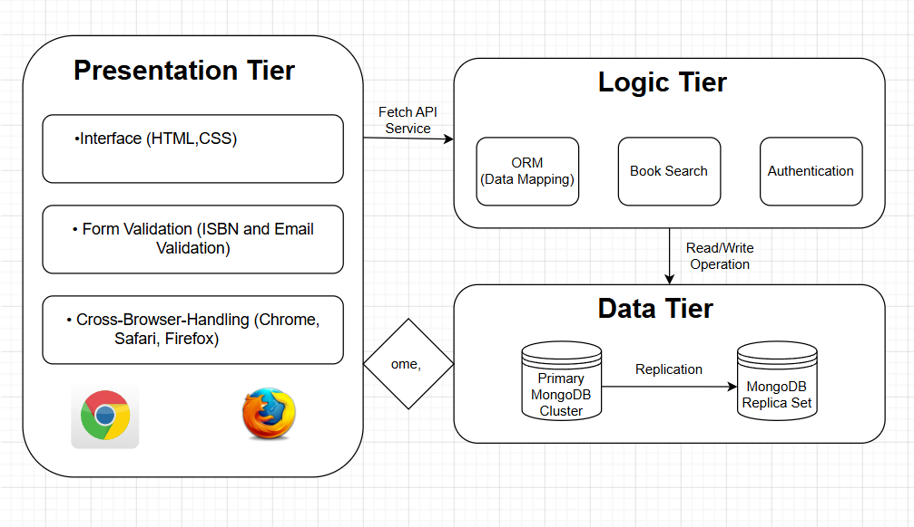

# Book Management System (BMS)

The Book Management System (BMS) is a simple web-based application developed to manage and store book information. It allows users to add book details such as title, author, ISBN, publication date, and genre through an easy-to-use interface. This project covers all Software Development Life Cycle (SDLC), architectural planning, and front-end implementation.

## Phase 1: Project Plan

### 1. Requirements Specification
The system requires a good working user interface to input and organize book records. The main users of this system are library staff or administrators who need a simple way to add and manage book records. The application must capture five essential data points: Title, Author, ISBN, Publication Date, and Genre.

### 2. Design Phase
In this phase, the overall structure of the Book Management System is planned. A simple and user-friendly interface is designed for entering book details. The Client-Server Model and 3-Tier Architecture are used to understand the system workflow and data flow.

### 3. Implementation Phase
The frontend of the application is developed using HTML5 and CSS. A form is created to collect book details from the user and store them for further processing. The goal is to build a responsive web page containing a fully validated form that matches the data constraints outlined in the requirements.

### 4. Testing Plan
Before deployment, the system will undergo structural testing:
* **Form Validation:** Ensuring the `required` attributes prevent empty submissions.
* **Input Type Matching:** Verifying the date picker and dropdown selection menus capture accurate data types.
* **Cross-Browser Compatibility:** Testing the interface across Chrome, Firefox, and Safari.

### 5. Deployment Strategy
The initial static frontend will be deployed using **GitHub Pages**, providing an instant, cloud-hosted URL for users to access the form interface.

### 6. Maintenance & Future Scope
Future updates will scale this static page into a dynamic application. In future versions, we can add few features such as book search, update, delete, user authentication, and database connectivity can be added to improve functionality. 

## System Architecture

### Client-Server Architecture

The Book Management System follows a Client-Server Architecture where the client (web browser) sends requests through the user interface and the server processes those requests. The server handles business logic, validation, and communication with the database before returning a response to the client.

This architecture provides:
- Separation of user interface and processing logic
- Centralized data management
- Better scalability and maintainability
- Secure communication between users and the system

---

### 3-Tier Architecture

The Book Management System is also designed using a 3-Tier Architecture model. This architecture separates the application into three independent layers:

#### 1. Presentation Tier (UI Layer)
- Developed using HTML5 and CSS3
- Handles user interaction
- Performs form validation
- Displays book information

#### 2. Application Tier (Business Logic Layer)
- Processes user requests
- Validates data
- Implements business rules
- Manages communication between UI and database

#### 3. Data Tier (Database Layer)
- Stores book records
- Maintains data integrity
- Supports CRUD operations (Create, Read, Update, Delete)

Benefits of 3-Tier Architecture:
- Improved scalability
- Better security
- Easier maintenance
- Independent development of each layer

